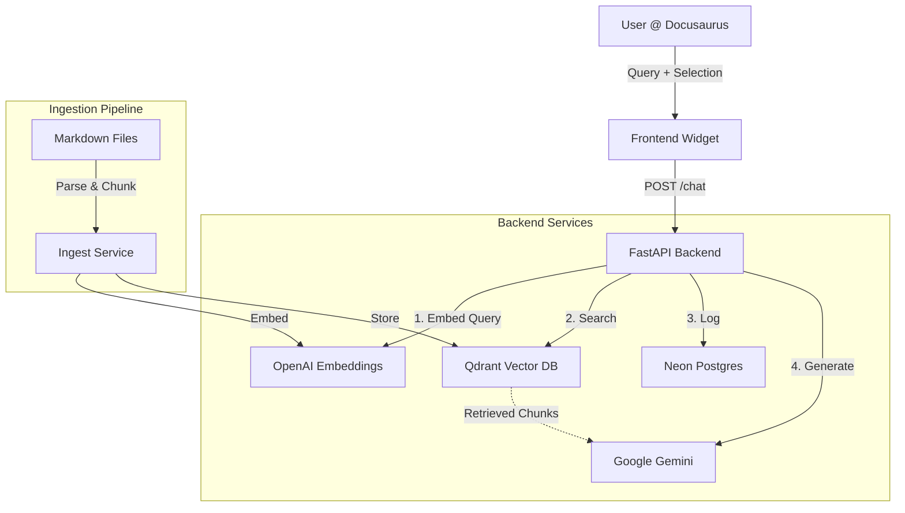

# Implementation Plan - RAG Chatbot Integration

**Feature**: RAG Chatbot Integration
**Status**: Planned
**Research**: [research.md](research.md)
**Data Model**: [data-model.md](data-model.md)
**Contracts**: [contracts/rag-api.yaml](contracts/rag-api.yaml)

## Technical Context

We are building a RAG chatbot embedded in a Docusaurus technical book. The system uses a FastAPI backend to orchestrate retrieval from Qdrant (vectors) and generation via Google Gemini (LLM), with interaction logging in Neon Postgres.

**Knowns:**
- **Frontend**: Docusaurus (React/TypeScript). Needs a new Chat Widget component.
- **Backend**: FastAPI (Python). Needs `ingest` and `chat` endpoints.
- **Vector DB**: Qdrant (Cloud). URL and Key provided by user.
- **Database**: Neon Postgres. Connection string provided by user.
- **LLM**: Google Gemini (via Google SDK or OpenAI compatible wrapper).
- **Embeddings**: OpenAI `text-embedding-3-small` (standard, reliable).

**Unknowns & Risks:**
- **Latency**: Hybrid search + Gemini latency needs to be < 5s.
- **Context Window**: Ensuring strict adherence to book content might require careful prompting.

## Constitution Check

- **Library-First**: The backend logic (ingestion, retrieval) will be structured as modular services (`services/ingest.py`, `services/retrieval.py`) inside the backend app, usable by scripts or API.
- **Test-First**: We will write tests for the API endpoints and the retrieval logic before finalizing implementation.
- **Integration**: The API contract is defined in `contracts/rag-api.yaml`.

## Phases

### Phase 1: Backend Core & Ingestion (The "Brain")
**Goal**: Can ingest markdown and retrieve relevant chunks via API.

- [ ] **Setup**: Init FastAPI project structure, configured `.env`.
- [ ] **Database**: Set up Neon Postgres schema (using SQLAlchemy or similar).
- [ ] **Vector Store**: Initialize Qdrant client and create collection `book_content`.
- [ ] **Ingestion Logic**: Implement `ingest_service` to walk `docs/`, split markdown, embed, and upload to Qdrant.
- [ ] **API**: Implement `POST /ingest` and `POST /chat` (basic echo first, then RAG).
- [ ] **Tests**: Unit tests for chunking; Integration test for Qdrant connectivity.

### Phase 2: Retrieval & Generation (The "Mind")
**Goal**: The API returns accurate answers based on the book.

- [ ] **Retrieval**: Implement hybrid/dense search in `retrieval_service`.
- [ ] **Generation**: Connect Google Gemini API. Construct system prompt with retrieved context.
- [ ] **Context Awareness**: Handle `selected_text` parameter in the prompt construction.
- [ ] **Logging**: Implement async logging to Neon Postgres for every chat interaction.
- [ ] **Evaluation**: Manual verification of answers against standard questions.

### Phase 3: Frontend Integration (The "Face")
**Goal**: User can interact with the bot on the website.

- [ ] **UI Component**: Create `ChatWidget.tsx` in Docusaurus.
- [ ] **State Management**: Handle chat history, loading states, and streaming responses.
- [ ] **Selection API**: Implement "Select text -> Ask AI" button logic (floating tooltip or context menu).
- [ ] **Integration**: efficient wiring of API calls to backend.

### Phase 4: Deployment & Polish
**Goal**: Live on Vercel.

- [ ] **Backend Deploy**: Deploy FastAPI to Vercel (serverless functions) or similar (Render/Railroad). *Note: User mentioned Vercel for the site. FastAPI on Vercel is possible but often has timeout limits (10s on free tier). If 10s is too tight for RAG, we might need to optimize or use a different host. For now, assume Vercel.*
- [ ] **Env Vars**: Configure production secrets.
- [ ] **Docs**: Finalize "Architecture" chapter in the book itself.

## Architecture Sketch

