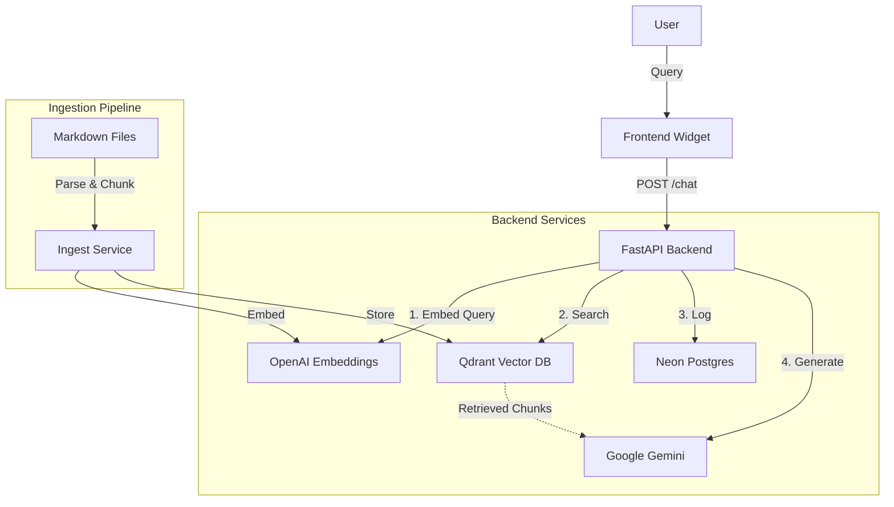

# Architecture

This module describes the architecture of the RAG (Retrieval-Augmented Generation) Chatbot integrated into this book.

## System Overview

The system consists of three main components:

1.  **Frontend (Docusaurus)**: A React-based chat widget embedded in the book site.
2.  **Backend (FastAPI)**: A Python API that handles ingestion and chat orchestration.
3.  **Data Stores**:
    *   **Qdrant**: Vector database for storing document embeddings.
    *   **Neon Postgres**: Relational database for logging interactions.
    *   **OpenAI/Google**: AI services for embeddings and generation.

## Diagram

## Data Flow

1.  **Ingestion**: Markdown files are read from the `docs/` directory, split into chunks (preserving headers), embedded using OpenAI `text-embedding-3-small`, and stored in Qdrant.
2.  **Retrieval**: When a user asks a question, the backend embeds the query and searches Qdrant for the top 5 most relevant chunks (Dense Retrieval).
3.  **Generation**: The retrieved chunks are formatted into a prompt ("Context") and sent to Google Gemini 1.5 Flash along with the user's question.
4.  **Streaming**: The response is streamed back to the frontend token by token.
